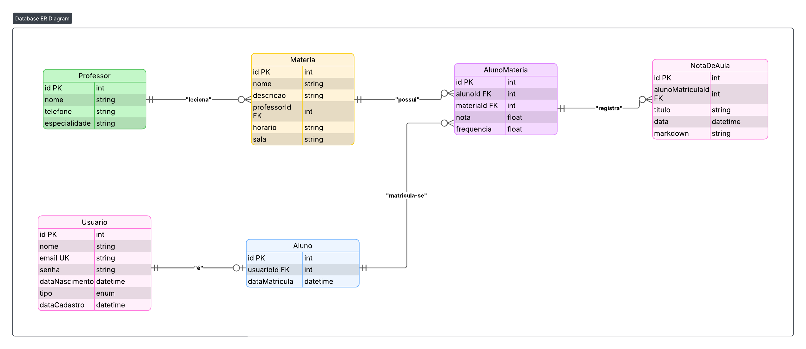

# 📚 Agenda de Alunos

**Sistema de gerenciamento acadêmico para alunos, professores e matérias.**

Aluno: Vinicius Carrocine Leite

---

## 🎯 Objetivo

Projeto base de Agenda de Alunos - uma plataforma que permite centralizar funcionalidades do dia a dia do aluno, facilitando o gerenciamento de matérias, professores e notas de aula.

> **Nota:** O escopo atual foca no gerenciamento de notas de aula, mas a arquitetura permite escalabilidade para integração com outros serviços institucionais.

---

## 🚀 Tecnologias

- **Node.js** - Runtime JavaScript
- **Express** - Framework web para API REST
- **TypeScript** - Superset tipado do JavaScript
- **Prisma** - ORM moderno para banco de dados
- **EJS** - Template engine para renderização server-side
- **Bootstrap** - Framework CSS via CDN
- **SQLite** - Banco de dados relacional
- **esbuild** - Bundler para compilação do código frontend

---

## 📁 Estrutura de Diretórios

```
/projeto-final
├─ .env                        # Variáveis de ambiente
├─ package.json                # Dependências e scripts
├─ prisma/
│  ├─ schema.prisma            # Schema do banco de dados
│  └─ migrations/              # Histórico de migrações
├─ public/                     # Assets estáticos servidos
│  └─ assets/                  # CSS, JS compilado, imagens
├─ src/
│  ├─ server.ts                # Entrada da aplicação
│  ├─ frontend/                # Código TypeScript do cliente
│  ├─ controllers/             # Controladores das rotas
│  ├─ models/                  # Modelos de domínio
│  ├─ middlewares/             # Middlewares personalizados
│  ├─ views/                   # Templates EJS
│  ├─ repositories/            # Camada de acesso ao banco
│  └─ services/                # Lógica de negócio
```


## 🗃️ Modelo de Dados



## ⚙️ Configuração e Execução

### Pré-requisitos

- Node.js 18+ (recomendado Node.js 20 LTS)
- npm ou yarn

### 1️⃣ Instalação

```bash
# Clone o repositório
git clone https://github.com/VNCHub/typescript-unifesp.git
cd projeto-final

# Instale as dependências
npm install
```

### 2️⃣ Configuração do Banco de Dados

```bash
# Configure o arquivo .env
echo 'DATABASE_URL="file:./dev.db"' > .env

# Execute as migrações
npx prisma migrate dev

# (Opcional) Popule o banco com dados iniciais
npx prisma db seed
```

### 3️⃣ Desenvolvimento

```bash
# Inicie o servidor em modo desenvolvimento
npm run dev

# O servidor estará disponível em http://localhost:3000
```

### 4️⃣ Produção

```bash
# Compile o código TypeScript
npm run build

# Execute a aplicação
npm start
```

### 5️⃣ Comandos Úteis do Prisma

```bash
# Visualizar o banco de dados no Prisma Studio
npx prisma studio

# Criar uma nova migração
npx prisma migrate dev --name nome_da_migracao

# Gerar o Prisma Client após mudanças no schema
npx prisma generate

# Verificar status das migrações
npx prisma migrate status
```

---

## 📋 Scripts Disponíveis

```json
{
  "dev": "Inicia o servidor em modo desenvolvimento",
  "build": "Compila o código TypeScript para JavaScript",
  "start": "Executa a aplicação em produção",
  "prisma:migrate": "Cria e aplica migrações do banco",
  "prisma:studio": "Abre interface visual do banco"
}
```

---

## 👥 Funcionalidades Principais

### Para Alunos
- ✅ Cadastro e autenticação
- ✅ Matrícula em matérias
- ✅ Registro de notas de aula em Markdown

### Para Administradores
- ✅ Gerenciamento de matérias

---

## 📄 Licença

Este projeto é parte de um trabalho acadêmico.

---

## 👤 Autor

**Vinicius Carrocine Leite**  
Data: Dezembro/2024